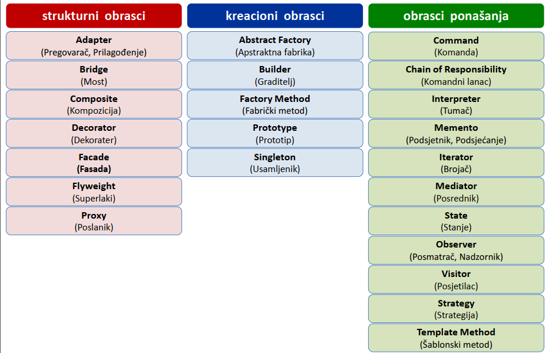

# Projektni Obrasci

Projektni obrazac predstavlja uopšteno (šablonsko) rješenje za tipične projektne probleme, koje omogućava višestruku upotrebu u rješavanju konkretnih projektnih situacija.
Projektni obrazac predstavlja jezgro za rješavanje konkretnih problema iste/slične prirode, tj. svaki put isto jezgro uz prilagođavanje konkretnoj situaciji. 
Mnogi projektni obrazci su sistematično dokumentovani i mogu slobodno da se koriste u projektovanju. Oni su dobar mehanizam za učenje projektovanja na osnovu tuđih iskustava i dobar mehanizam za učenje pisanja čitljivog koda-"Clean Code".  
Takozvani Gang of Four (GoF) obrasci, koji će ovdje biti opisani, predstavljaju osnovu za sve ostale obrasce. Oni su kategorisani u tri grupe: kreacioni, strukturni i obrasci ponašanja. Da bi ovi obrasci bili bolje shvaćeni svaki od njih je predstavljen (preko Java koda) i kao strukturni i kao primjer iz stvarnog svijeta. Primjer iz stvarnog svijeta predstavlja upotrebu obrasca u nekoj situaciji veoma bliskoj realnoj.  
  
# Klasifikacija:  
- Kreacioni obrazac - obrazac koji je fokusiran na kreiranje objekata
- Strukturni obrazac - obrazac koji je fokusiran na strukturu
- Obrazac ponašanja - obrazac koji je fokusiran na kolaboraciju objekata  

