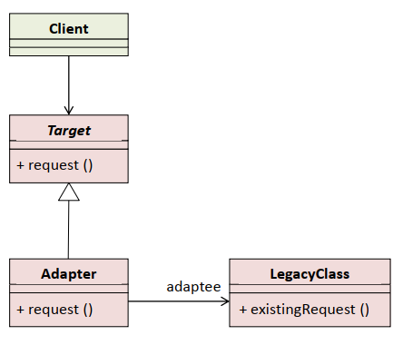

# Adapter - pregovarač, prilagođenje

Obezbjeđuje interfejs između različitih klasa i prilagođava interfejs jedne klase u interfejs kakav očekuje druga klasa, čime omogućava komunikaciju koja inače ne bi mogla da se ostvari.

