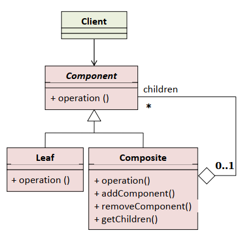

# Composite - kompozicija

Formira složenu hijerarhijsku strukturu proizvoljne širine i dubine i omogućava klijentu da na isti način tretira i proste i složene objekte koji su dio kompleksne strukture  

