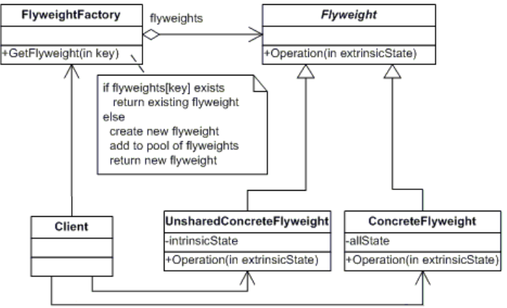
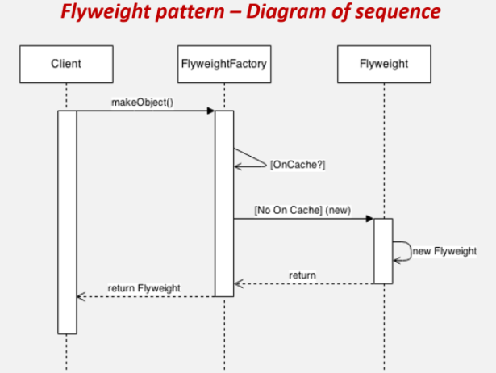

# Flyweight - superlaki  
Koristi princip deljenja resursa(sharing) da bi obezbedio efikasniju podršku većem broju malih objekata.  

  
  Flyweight
  - deklariše interfejs kroz koji superlaki objekti (flyweights) mogu funkcionisati i kroz neodređena (extrinsic) stanja  
  
  ConcreteFlyweight 
  - implementira Flyweight interfejs i čuve podatke o neodređenim stanjima objekata, ako postoje. Objekti klase ConcreteFlyweight moraju biti deljivi (sharable).
  
  UnsharedConcreteFlyweight 
  -nije neophodno sa sve podklase klase Flyweight budu deljive. Interfejs klase Flyweight omogućava deljenje ali ga ne forsira. Zajedničko svim objektima klase UnsharedConcreteFlyweight je da imaju objekte klase ConcreteFlyweight u svojoj strukturi. 
  
  FlyweightFactory 
 - kreira i vodi računa o „flyweight“ onjektima
 - obezbeđuje da „flyweight“ objekti budu zaista deljevi. Kada klijent zahteva „flyweight“ objekat klasa FlyweightFactory mu prosleđuje odgovarajući „flyweight“,  ili kreira jedan takav objekat ako nijedan ne postoji.
 
  Client 
- čuve reference na flyweight objekte
- proračunava i čuva podatke o neodređeni

